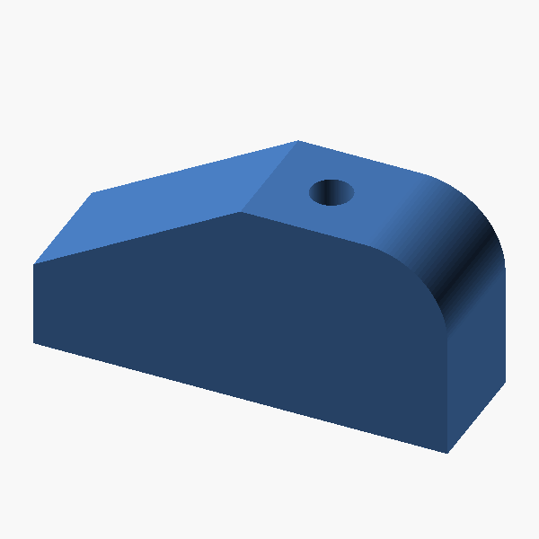
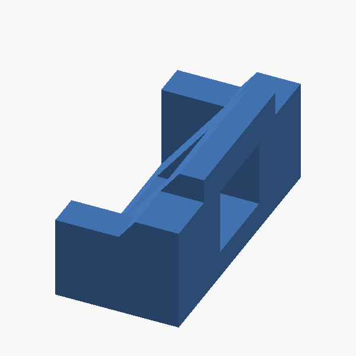
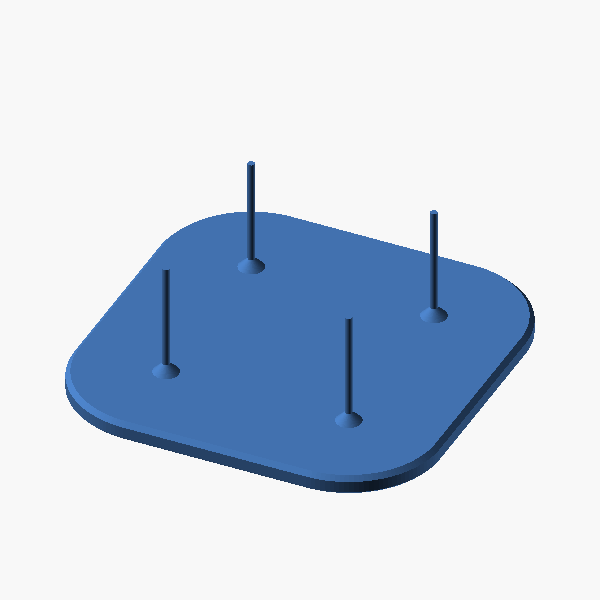
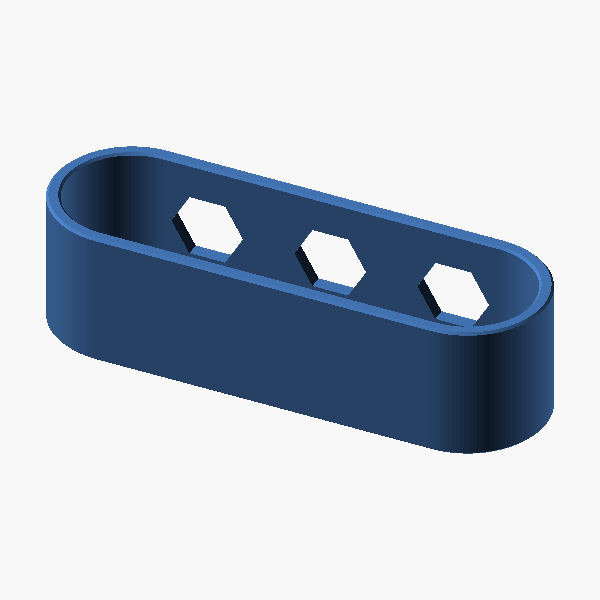

# 📐 CAD Lab

> My learning path for [FreeCAD](https://www.freecad.org/) and [KiCad](https://www.kicad.org/).
> 
> A place to drop everything I go through while learning: tutorials, quick demos, projects, notes and resources.


## 📘 Official docs

- [FreeCAD Wiki](https://wiki.freecad.org/Main_Page)
  - [Tutorials - Modeling parts](https://wiki.freecad.org/Tutorials#Modeling_parts)

## 🧩 Tutorials

> Guided exercises following the official wiki tutorials and videos.

| Model | Example / Tutorial | Resources |
|:---:|---|---|
| [](./tutorials/01-simple-part-with-part-design/01-simple-part-with-part-design.stl) | **[01 - Simple Part with Part Design](./tutorials/01-simple-part-with-part-design/01-simple-part-with-part-design.stl)**<br>Sketching, pads, and building a first part. | [📖 Creating a simple part with PartDesign](https://wiki.freecad.org/Creating_a_simple_part_with_PartDesign) <br> [▶️ FreeCAD Academy - Simple Part with Part Design (EN)](https://youtu.be/FVKhejma69U) |
| [](./tutorials/02-basic-part-design-tutorial/02-basic-part-design-tutorial.stl) | **[02 - Basic Part Design Tutorial](./tutorials/02-basic-part-design-tutorial/02-basic-part-design-tutorial.stl)**<br>Pockets and building a part from multiple sketches on different faces. | [📖 Basic Part Design Tutorial 019](https://wiki.freecad.org/Basic_Part_Design_Tutorial_019) <br> [▶️ FreeCAD Academy - Basic Part Design Tutorial (English)](https://www.youtube.com/watch?v=c1K-jBWytSQ) <br> [▶️ Stolz3D - The Basic Part Design Tutorial from the Official Documentation](https://www.youtube.com/watch?v=0-Chk84Le9E) |
| [](./tutorials/03-toothbrush-head-stand-1-plate/03-toothbrush-head-stand-1-plate.stl)[](./tutorials/03-toothbrush-head-stand-2-band/03-toothbrush-head-stand-2-band.stl) | **03 - Toothbrush Head Stand** ([Part 1](./tutorials/03-toothbrush-head-stand-1-plate/03-toothbrush-head-stand-1-plate.stl), [Part 2](./tutorials/03-toothbrush-head-stand-2-band/03-toothbrush-head-stand-2-band.stl))<br>Datum planes and feature editing. Two parts - a plate and a band. <br> 📚 Extras: [Topological naming problem](https://wiki.freecad.org/Topological_naming_problem) · [Feature editing](https://wiki.freecad.org/Feature_editing) · [PartDesign Plane](https://wiki.freecad.org/PartDesign_Plane) | [📖 Toothbrush Head Stand](https://wiki.freecad.org/Toothbrush_Head_Stand) |
| ⏳ | **04 - Modeling for product design**<br>Next up - a full product-design part in PartDesign (sketch → pad / revolve / pocket, parametric edits). | [📖 Manual: Modeling for product design](https://wiki.freecad.org/Manual:Modeling_for_product_design) |
| 📋 | **xx - SOLIDWORKS CSWP challenge**<br>Someday, no fixed order. | [▶️ Deltahedra - Can FreeCAD pass the SOLIDWORKS Pro Certification CSWP?](https://youtu.be/VEfNRST_3x8) |
| 📋 | **xx - Heavy Duty Wall Hook (3D printing)**<br>Someday, no fixed order. | [▶️ CAD CAM COURSE - FreeCAD for 3D Printing - Heavy Duty Wall Hook (01 of 40)](https://youtu.be/2ekwGia_7Es) |

## 🎓 Courses

- [▶️ CAD CAM COURSE - FreeCAD Beginner Course](https://www.youtube.com/playlist?list=PLMaBN2Rl34I0Kz9ZKF1Srd2x44wCu3Fdr)
- [▶️ CAD CAM COURSE - FreeCAD Beginners for 3D Printing](https://www.youtube.com/playlist?list=PLMaBN2Rl34I3vu2Bo4M-2_8BIvhd6oDv-)

## 📚 Resources

- [▶️ Deltahedra - FreeCAD 1.1 is Finally HERE - It's a GAME CHANGER!](https://www.youtube.com/watch?v=bYdobpjTypg)
- [▶️ Deltahedra - 25 FreeCAD Hacks (You probably don't know)](https://www.youtube.com/watch?v=vwXklzvvxIA)
- [▶️ Deltahedra - STOP using FreeCAD WRONG! Do this INSTEAD](https://youtu.be/JjFh8vtMBC8)

## 🗂 Repo conventions

<details>
<summary>Folder layout, naming, and how to regenerate exports</summary>

### Layout

- `tutorials/` - guided exercises following official wiki tutorials or videos
- `projects/` - real things I design for myself (will show up when the first one lands)

Each exercise lives in its own folder, and the `.FCStd` is named after the folder - e.g. `tutorials/01-simple-part-with-part-design/01-simple-part-with-part-design.FCStd`. Alongside it sit two generated files:

- `<name>.stl` - the mesh. GitHub can't render `.FCStd`, but it renders `.stl` with an interactive 3D viewer.
- `preview.png` - a clean isometric render of the mesh (via OpenSCAD), shown inline in the table above.

Multi-part tutorials number each part so it sorts in build order - e.g. `03-toothbrush-head-stand-1-plate`, `03-toothbrush-head-stand-2-band`.

### Regenerating STL + previews

From the repo root, after changing any model:

```bash
freecadcmd scripts/export-stl.py
```

The script walks every `.FCStd` in the exercise folders and writes the matching `.stl` and `preview.png` next to it. Requires [OpenSCAD](https://openscad.org/) on the `PATH` for the preview render (`brew install openscad`).

</details>
